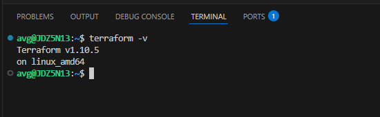
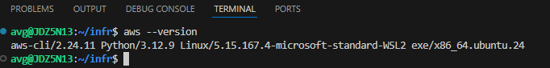
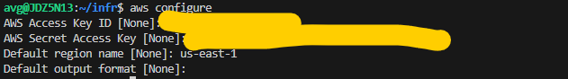

# Setup Sandbox VM for Developers using Terraform and Ansible

This solution automates infrastructure configuration and provisioning in AWS using Ansible and Terraform. 
It includes steps for setting up Terraform for provisioning, Ansible for configuration, the AWS CLI, and Jenkins for automation.

## Prerequisites
- Linux Ubuntu Distribution
- Install `python3` on Ubuntu
- Install `wget` on Ubuntu
- Install `curl` on Ubuntu
- Install `unzip` on Ubuntu
- AWS Account with credentials

## Install Terraform (Using the OS Ubuntu)
```bash 
$ wget -O - https://apt.releases.hashicorp.com/gpg | sudo gpg --dearmor -o /usr/share/keyrings/hashicorp-archive-keyring.gpg
$ echo "deb [arch=$(dpkg --print-architecture) signed-by=/usr/share/keyrings/hashicorp-archive-keyring.gpg] https://apt.releases.hashicorp.com $(lsb_release -cs) main" | sudo tee /etc/apt/sources.list.d/hashicorp.list
$ sudo apt update && sudo apt install terraform
```
### Output


## Install and Configure AWS CLI
### AWS CLI Installation
```bash
$ curl "https://awscli.amazonaws.com/awscli-exe-linux-x86_64.zip" -o "awscliv2.zip"
$ unzip awscliv2.zip
$ sudo ./aws/install
$ aws --version
```
#### Output

### AWS CLI Configuration
```bash
$ aws configure
## it will ask for aws cli access key, secret key and its zone.Please provide those.
```


## Terraform Configuration Directory Structure
Configuration of terraform, structred as follows
```bash
.
├── main.tf ## Entry point for terraform configuration
└── modules
    ├── instance ## Configuration for aws instance and remote-exec provisioning
    │   ├── main.tf
    │   └── variables.tf
    ├── security-group ## Configuration for aws security group
    │   ├── main.tf
    │   └── variables.tf
    ├── ssh-keypair ## Configuration for SSH Key
    │   ├── main.tf
    │   └── variables.tf
    └── vpc    ## Configuration for aws vpc and subnet
        ├── main.tf
        └── variables.tf
```


## Terraform Configuration for Provisioning AWS Instance


### Validate the Terraform Configuration ⚠️  
*Note: This only validates the Terraform configuration. Provisioning will be automated using Jenkins.*
```bash
$ terraform init
$ terraform validate
$ terraform plan
``` 
