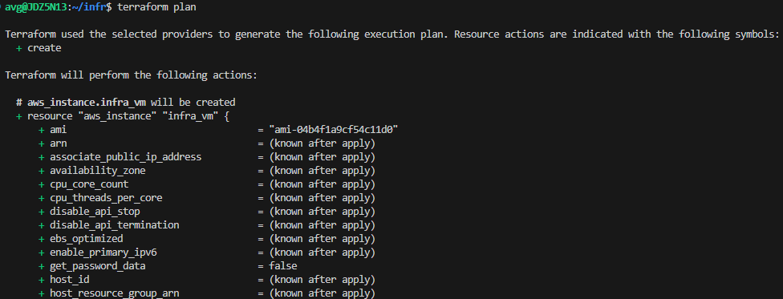

# Setup Sandbox VM for Developers using Terraform and Ansible

This solution automates infrastructure configuration and provisioning in AWS using Ansible and Terraform. 
It includes steps for setting up Terraform for provisioning, Ansible for configuration and the AWS CLI
## Prerequisites
- Linux Ubuntu Distribution
- Install `wget` on Ubuntu
- Install `curl` on Ubuntu
- Install `unzip` on Ubuntu
- AWS Account with credentials

## Install Ansible(Using the OS Ubuntu)
```bash
$ sudo apt update -y
$ sudo apt install -y software-properties-common
$ sudo add-apt-repository --yes --update ppa:ansible/ansible
$ sudo apt install -y ansible
$ ansible --version
```



## Install Terraform (Using the OS Ubuntu)
```bash 
$ wget -O - https://apt.releases.hashicorp.com/gpg | sudo gpg --dearmor -o /usr/share/keyrings/hashicorp-archive-keyring.gpg
$ echo "deb [arch=$(dpkg --print-architecture) signed-by=/usr/share/keyrings/hashicorp-archive-keyring.gpg] https://apt.releases.hashicorp.com $(lsb_release -cs) main" | sudo tee /etc/apt/sources.list.d/hashicorp.list
$ sudo apt update && sudo apt install terraform
```
### Output


## Install and Configure AWS CLI
### AWS CLI Installation
```bash
$ curl "https://awscli.amazonaws.com/awscli-exe-linux-x86_64.zip" -o "awscliv2.zip"
$ unzip awscliv2.zip
$ sudo ./aws/install
$ aws --version
```
#### Output

### AWS CLI Configuration
```bash
$ aws configure
## it will ask for aws cli access key, secret key and its zone.Please provide those.
```


## Create Ansible Playbook
Create `ansible/playbook.yml` with the following content to install necessary packages and create a user.
```yml
- name: Configure Developer Infrastructure
  hosts: infra_vm
  become: yes
  tasks:
    - name: Install necessary packages
      apt:
        name:
          - git
          - vim
          - curl
        state: present
        update_cache: yes

    - name: Create a new user 'infra_user'
      user:
        name: infra_user
        password: "{{ 'password' | password_hash('sha512') }}"
        shell: /bin/bash

    - name: Set up SSH authorized key for infra_user
      authorized_key:
        user: infra_user
        state: present
        key: "{{ lookup('file', '~/.ssh/infra-key.pub') }}"
```

## Terraform Configuration Directory Structure
Configuration of terraform, structred as follows
```bash
.
├── main.tf ## Entry point for terraform configuration
└── modules
    ├── instance ## Configuration for aws instance and remote-exec provisioning
    │   ├── main.tf
    │   └── variables.tf
    ├── security-group ## Configuration for aws security group
    │   ├── main.tf
    │   └── variables.tf
    ├── ssh-keypair ## Configuration for SSH Key
    │   ├── main.tf
    │   └── variables.tf
    └── vpc    ## Configuration for aws vpc and subnet
        ├── main.tf
        └── variables.tf
```


## Terraform Configuration for Provisioning AWS Instance
### Configure Terraform SSH and its Keys
```tf
# modules modules/ssh-keypair/main.tf
# Generate an RSA Private Key
resource "tls_private_key" "infra_rsa" {
  algorithm = "RSA"
}

# Create an AWS Key Pair
resource "aws_key_pair" "infra_key_pair" {
  key_name   = var.key_name
  public_key = tls_private_key.infra_rsa.public_key_openssh
}

# Store the Private Key Locally
resource "local_file" "infra_private_key" {
  content      = tls_private_key.infra_rsa.private_key_pem
  filename     = var.key_file_name
  file_permission = "0400"
}

output "key_name" {
  value = aws_key_pair.infra_key_pair.key_name
}

output "private_key_pem" {
  value = tls_private_key.infra_rsa.private_key_pem
  sensitive = true
}
```
```tf
# modules/ssh-keypair/variables.tf
variable "key_name" {
  type    = string
  default = "infra-key"
}

variable "key_file_name" {
  type    = string
  default = "infra-key.pem"
}
```
### Configure Terraform AWS VPC and Subnet
```tf
# modules/vpc/main.tf

# Create AWS VPC (Virtual Private Cloud)
resource "aws_vpc" "infra_vpc" {
  cidr_block = var.cidr_block
  tags = {
    Name = var.vpc_name
  }
}

# Create AWS Subnet
resource "aws_subnet" "infra_subnet" {
  vpc_id                  = aws_vpc.infra_vpc.id
  cidr_block              = var.subnet_cidr_block
  map_public_ip_on_launch = true
  depends_on              = [aws_vpc.infra_vpc]
  tags = {
    Name = var.subnet_name
  }
}

# Create AWS Internet Gateway
resource "aws_internet_gateway" "infra_gw" {
  vpc_id = aws_vpc.infra_vpc.id
  depends_on = [aws_vpc.infra_vpc]
  tags = {
    Name = var.internet_gateway_name
  }
}


# Create AWS Route Table
resource "aws_route_table" "infra_route_table" {
  vpc_id = aws_vpc.infra_vpc.id
  depends_on = [aws_vpc.infra_vpc]
  tags = {
    Name = var.route_table_name
  }
}

# Adds a route in the route table
resource "aws_route" "infra_route" {
  route_table_id         = aws_route_table.infra_route_table.id
  destination_cidr_block = "0.0.0.0/0"
  gateway_id             = aws_internet_gateway.infra_gw.id
  depends_on             = [aws_route_table.infra_route_table, aws_internet_gateway.infra_gw]
}

# Links the subnet to the route table.
resource "aws_route_table_association" "infra_route_association" {
  subnet_id      = aws_subnet.infra_subnet.id
  route_table_id = aws_route_table.infra_route_table.id
  depends_on     = [aws_subnet.infra_subnet, aws_route_table.infra_route_table]
}

output "vpc_id" {
  value = aws_vpc.infra_vpc.id
}

output "subnet_id" {
  value = aws_subnet.infra_subnet.id
}

output "internet_gateway_id" {
  value = aws_internet_gateway.infra_gw.id
}
```
```tf
# modules/vpc/variables.tf
variable "cidr_block" {
  type    = string
  default = "10.0.0.0/16"
}

variable "subnet_cidr_block" {
  type    = string
  default = "10.0.1.0/24"
}

variable "vpc_name" {
  type    = string
  default = "infra-vpc"
}

variable "subnet_name" {
  type    = string
  default = "infra-subnet"
}

variable "internet_gateway_name" {
  type    = string
  default = "infra-gw"
}

variable "route_table_name" {
  type    = string
  default = "infra-route-table"
}
```
### Configure Terraform AWS Security Group
```tf
# modules/security-group/main.tf

# Create a Security Group
resource "aws_security_group" "infra_sg" {
  name   = var.security_group_name
  vpc_id = var.vpc_id

  # Inbound Rules  
  ingress {
    from_port   = var.ingress_from_port
    to_port     = var.ingress_to_port
    protocol    = var.ingress_protocol
    cidr_blocks = var.ingress_cidr_blocks
  }

  # Outbound Rules
  egress {
    from_port   = 0
    to_port     = 0
    protocol    = "-1"
    cidr_blocks = ["0.0.0.0/0"]
  }

  tags = {
    Name = var.security_group_name
  }
}

output "security_group_id" {
  value = aws_security_group.infra_sg.id
}
```
```tf
# modules/security-group/variables.tf
variable "security_group_name" {
  type    = string
  default = "infra-sg"
}

variable "vpc_id" {
  type = string
}

variable "ingress_from_port" {
  type    = number
  default = 22
}

variable "ingress_to_port" {
  type    = number
  default = 22
}

variable "ingress_protocol" {
  type    = string
  default = "tcp"
}

variable "ingress_cidr_blocks" {
  type    = list(string)
  default = ["0.0.0.0/0"]
}
```
### Configure Terraform AWS Instance with Remote-Exec Ansible Provisioner
```tf
# modules/instance/main.tf
#  Create an EC2 Instance
resource "aws_instance" "infra_vm" {
  ami                         = var.ami_id
  instance_type               = var.instance_type
  associate_public_ip_address = true
  subnet_id                   = var.subnet_id
  vpc_security_group_ids      = [var.security_group_id]
  key_name                    = var.key_name

  tags = {
    Name = var.instance_name
  }

 # SSH Connection
  connection {
    type        = "ssh"
    host        = self.public_ip
    user        = var.ssh_user
    private_key = var.private_key_pem
    timeout     = "2m"
  }

  # Remote-Exec Provisioner for installing Ansible on EC2 machine
  provisioner "remote-exec" {
    inline = [
      "sudo apt update -y",
      "sudo apt install ansible -y",
    ]
  }
}

output "public_ip" {
  value = aws_instance.infra_vm.public_ip
}
```
```tf
# modules/instance/variables.tf
variable "ami_id" {
  type    = string
  default = "ami-04b4f1a9cf54c11d0"
}

variable "instance_type" {
  type    = string
  default = "t2.micro"
}

variable "subnet_id" {
  type = string
}

variable "security_group_id" {
  type = string
}

variable "key_name" {
  type = string
}

variable "private_key_pem" {
  type = string
  sensitive = true
}

variable "instance_name" {
  type    = string
  default = "Infra-Developer-VM"
}

variable "ssh_user" {
    type = string
    default = "ubuntu"
}
``` 
### Terraform Entry Point Conifguration or Provider Configuration
```tf
# ./main.tf
locals {
  aws_region = "us-east-1"
}

provider "aws" {
  region = local.aws_region
}

module "vpc" {
  source = "./modules/vpc"
}

module "ssh_keypair" {
  source = "./modules/ssh-keypair"
}

module "security_group" {
  source            = "./modules/security-group"
  vpc_id            = module.vpc.vpc_id
}

module "instance" {
  source             = "./modules/instance"
  subnet_id          = module.vpc.subnet_id
  security_group_id  = module.security_group.security_group_id
  key_name           = module.ssh_keypair.key_name
  private_key_pem    = module.ssh_keypair.private_key_pem
}

output "instance_public_ip" {
  value = module.instance.public_ip
}
```
### Apply the Terraform Configuration
```bash
$ terraform init
$ terraform validate
$ terraform plan
$ terraform apply -auto-approve
```