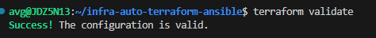
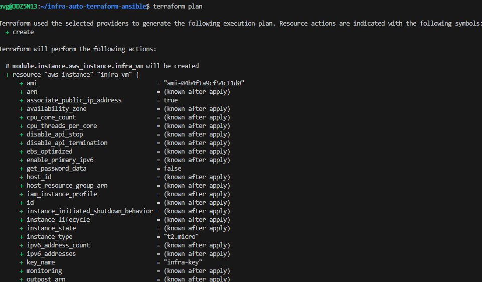
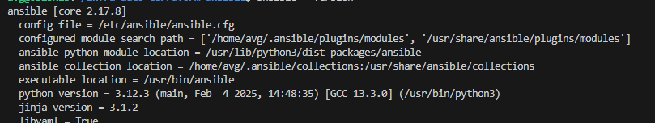

# Setup Sandbox VM for Developers using Terraform and Ansible

This solution automates infrastructure configuration and provisioning in AWS using Ansible and Terraform. 
It includes steps for setting up Terraform for provisioning, Ansible for configuration, the AWS CLI, and Jenkins for automation.

## Prerequisites
- Linux Ubuntu Distribution
- Install `python3` on Ubuntu
- Install `wget` on Ubuntu
- Install `curl` on Ubuntu
- Install `unzip` on Ubuntu
- AWS Account with credentials

## Install Terraform (Using the OS Ubuntu)
```bash 
$ wget -O - https://apt.releases.hashicorp.com/gpg | sudo gpg --dearmor -o /usr/share/keyrings/hashicorp-archive-keyring.gpg
$ echo "deb [arch=$(dpkg --print-architecture) signed-by=/usr/share/keyrings/hashicorp-archive-keyring.gpg] https://apt.releases.hashicorp.com $(lsb_release -cs) main" | sudo tee /etc/apt/sources.list.d/hashicorp.list
$ sudo apt update && sudo apt install terraform
```
### Output


## Install and Configure AWS CLI
### AWS CLI Installation
```bash
$ curl "https://awscli.amazonaws.com/awscli-exe-linux-x86_64.zip" -o "awscliv2.zip"
$ unzip awscliv2.zip
$ sudo ./aws/install
$ aws --version
```
#### Output

### AWS CLI Configuration
```bash
$ aws configure
## it will ask for aws cli access key, secret key and its zone.Please provide those.
```


## Terraform Configuration for Provisioning AWS Instance
### Configure Terraform with SSH Key
Terraform configuration will generate an SSH key pair module, store the public key in AWS as an EC2 key pair, and save the private key locally for secure access to EC2 instances 
```bash
$ nano modules/ssh-keypair/variables.tf
```
```tf
## modules/ssh-keypair/variables.tf
variable "key_name" {
  type    = string
  default = "infra-key"
}

variable "key_file_name" {
  type    = string
  default = "infra-key.pem"
}
```
```bash
$ nano modules/ssh-keypair/main.tf
```
```tf
## modules/ssh-keypair/main.tf
resource "tls_private_key" "main" {
  algorithm = "RSA"
}

resource "aws_key_pair" "main" {
  key_name   = var.key_name
  public_key = tls_private_key.main.public_key_openssh
}

resource "local_file" "private_key" {
  content      = tls_private_key.main.private_key_pem
  filename     = var.key_file_name
  file_permission = "0400"
}

output "key_name" {
  value = aws_key_pair.main.key_name
}

output "private_key_pem" {
  value = tls_private_key.main.private_key_pem
  sensitive = true
}
```

### Please Validate the Terraform Configuration(!! This is for just checking and we are going to automate these provisioing using Jenkins)
```bash
$ terraform init
$ terraform validate
$ terraform plan
``` 
#### Output


