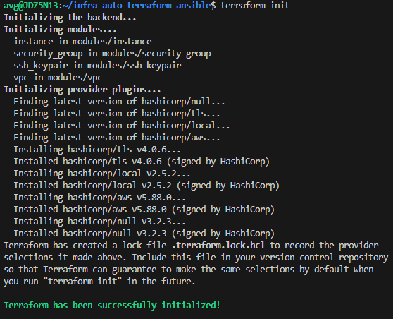

# Setup Sandbox VM for Developers using Terraform and Ansible

This solution automates infrastructure configuration and provisioning in AWS using Ansible and Terraform. 
It includes steps for setting up Terraform for provisioning, Ansible for configuration, the AWS CLI, and Jenkins for automation.

## Install Terraform
```bash 
$ wget -O - https://apt.releases.hashicorp.com/gpg | sudo gpg --dearmor -o /usr/share/keyrings/hashicorp-archive-keyring.gpg
$ echo "deb [arch=$(dpkg --print-architecture) signed-by=/usr/share/keyrings/hashicorp-archive-keyring.gpg] https://apt.releases.hashicorp.com $(lsb_release -cs) main" | sudo tee /etc/apt/sources.list.d/hashicorp.list
$ sudo apt update && sudo apt install terraform
```
### Output


## Terraform SSH Key Configuration
### Generate SSH Key
```bash
$ ssh-keygen -t rsa -b 4096 -f ~/.ssh/infra-key
```
#### Ouput 

### Add SSH Public Key to Terraform
```bash
## Create terraform configuration file and add the ssh public key resource
$ nano main.tf
```
```tf
resource "aws_key_pair" "infra_key" {
  key_name   = "infra-key"
  public_key = file("~/.ssh/infra-key.pub")
}
```